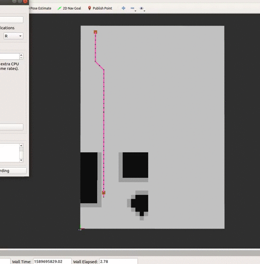

# Global Incremental Planning Algorithms

### Author: Rico Ruotong Jia

### Description
This package currently has 1.Lifelong Planning A* 2. D* Lite 3. a visualization node. The PRM package is used to provide 
a grid map for visualization and planning . 

##### Algorithm Description 
###### Life-long Planning A Star

###### D Star Lite 
 
 
One potential flaw of the implementation is that it might get into an infinite loop that jumps between two cells (i.e, for one cell, the other has the lowest total true cost), 
which is caused by heuristics selection. 
For example, h = euclidean_distance(a,b) does not work for every test case, however, h = 0.5 * euclidean_distance(a, b) does. 
A not very efficient but safe option is to expand every locally inconsistent node in the priority queue. This way, all cells in the map will be evaluated.

Another implementation detail is the cost function now is Euclidean distance. Compared with Manhattan distance, Euclidean distance reduces overestimation.    
##### Not reachable goal
In both algorithms, If start or goal are not reachable, a ROS_Fatal message will be printed, and the visualization node will die.     

### Usage
To visualize LPA* path, do 
```
$ roslaunch global_planning_algos global_planning.launch algo_select:=3
```

To visualize D* Lite path, do
```
$ roslaunch global_planning_algos global_planning.launch algo_select:=4
```

